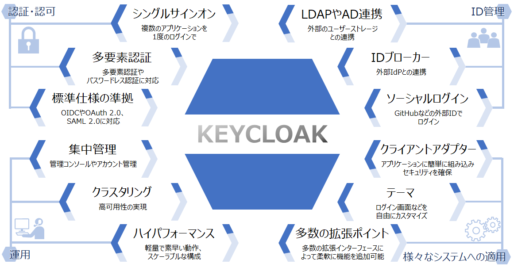
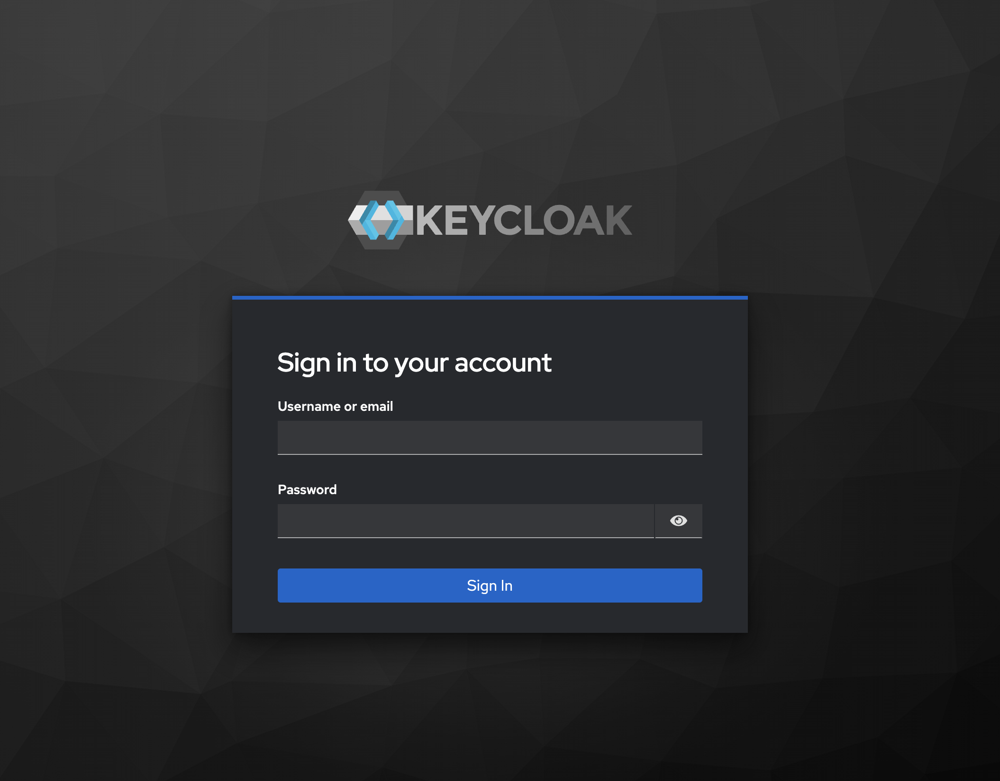
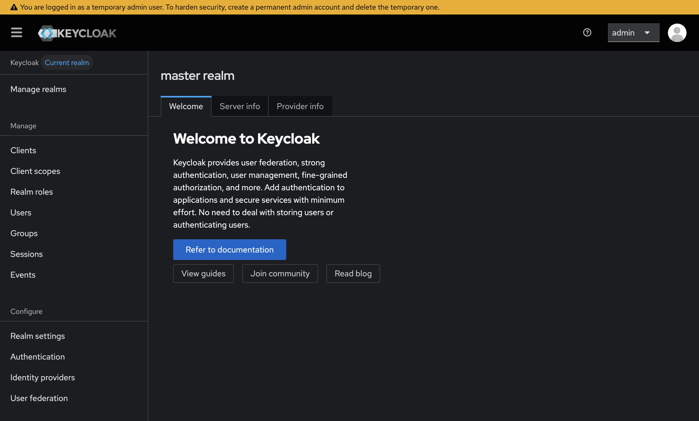
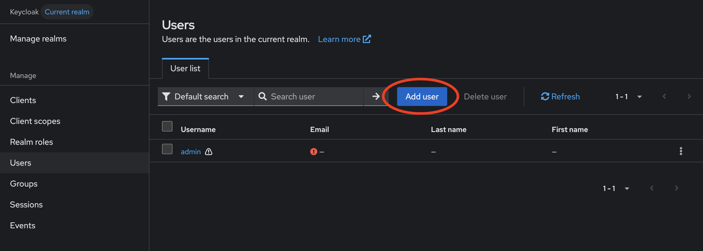
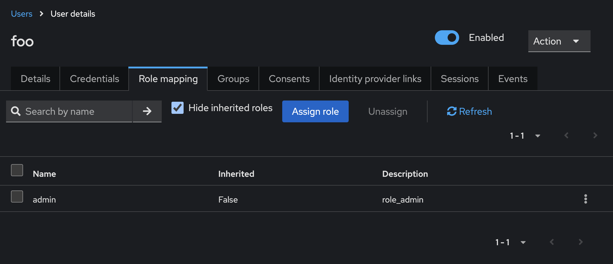

## Keycloakとは？

IDとアクセス管理（IAM）を実現するオープンソースソフトウェアで、シングルサインオン（SSO）や認証・認可を簡単に実現できる。

以下は https://www.hitachi.co.jp/products/it/oss/efforts/keycloak/index.html から引用した画像。



https://github.com/keycloak/keycloak

https://www.keycloak.org/documentation.html

## Keycloakを実際に動かしみる

ここではDocker Composeを使ってKeycloakを実際に使ってみます。

```sh
gh repo clone keycloak/keycloak
cd quarkus/container/Dockerfile
```

Dockerfileの`KEYCLOAK_VERSION`を https://github.com/keycloak/keycloak/releases の最新のバージョンで指定します。

```compose.yml
services:
  keycloak:
    image: quay.io/keycloak/keycloak:26.2.3
    ports:
      - 8080:8080
    tty: true
    command: start-dev
    environment:
      KEYCLOAK_ADMIN: admin
      KEYCLOAK_ADMIN_PASSWORD: admin
```

docker composeを起動します。

```sh
docker compose up -d
```

http://localhost:8080 にアクセスすると以下のようなログイン画面になります。



ユーザネームとパスワードは`KEYCLOAK_ADMIN`と`KEYCLOAK_ADMIN_PASSWORD`で指定した値となります。上記のdocker composeの場合だと両方adminとなっています。

ログインすると以下のような画面になります。



### adminユーザの削除

adminユーザは非推奨のため削除しておきましょう。

adminユーザを削除する前にUsers > Add Userからユーザを作成しておきます。



Users > User details > Role Mappingで作成したUserにロールを付与します。
例えば、以下のように管理者権限をユーザに持たせる場合は、以下のようにadminを付与します。


