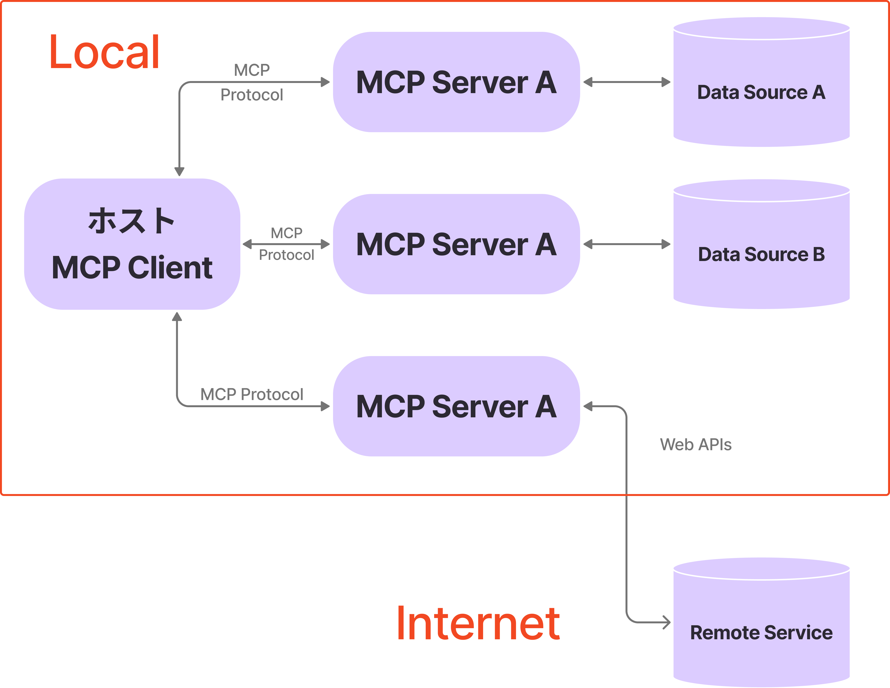
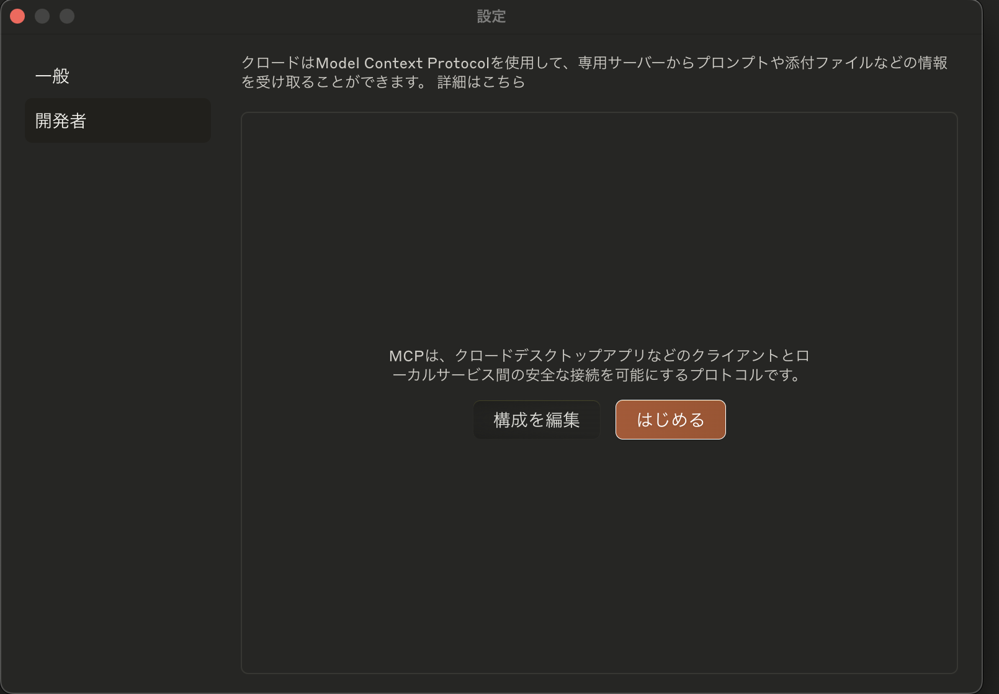

## MCPとは

MCPとは、Model Context Protocol の略で Anthropic 社が提唱したオープンソースのプロトコル。
LLM(Large Language Model)にコンテキストを提供する方法を標準化するためのもの。つまり、MCPはLLMを使用する際に外部システムと連携するための標準インターフェイスを提供する。

* LLMに直接接続できる、構築済みの統合のリストが増えています
* LLMプロバイダーとベンダーを切り替える柔軟性
* インフラストラクチャ内でデータを保護するためのベストプラクティス

## MCPが連携する外部リソース

MCPが連携する外部のリソースは以下のように3種類に分類することができる。

* Tools(ツール) : LLMがデータベースを照会したり、メールを送信するなどのアクションを実行する
* Resources(リソース) :モデルが出力を生成する際に参照する構造化データ（例えば、文書、ログ、APIの応答など）を提供する
* Prompts(プロンプト) : 対話するための事前定義されたテンプレートで、一貫性と効率を確保する

## MCPのアーキテクチャ

MCPはクライアントサーバアーキテクチャに従う。



|   用語   |     説明     |
| :--------: | :---------- |
|  MCPホスト  | MCPを介してデータにアクセスする Claude Desktop、IDE、AIツールなどのプログラム  |
|  MCPサーバ  | MCPを通じて特定の機能を公開する軽量プログラム |
|  MCPクライアント  | サーバと1:1でコネクションするプロトコルクライアント  |
|  ローカル<br/>データソース  | MCPサーバが安全にアクセスできるローカルのファイル、データベース、サービス  |
|  リモートサービス  |  MCPサーバが外部API等で接続できるインターネット上の外部システム |

## MCPホスト

簡単にMCPホストであるClaude Desktopの使用方法を解説します。
ここではインストールにHomebrewを使用します。

```sh
brew install --cask claude
```

Claude > 設定 > 開発者を開きます。



構成を編集を押すと、`claude_desktop_config.json`が存在するディレクトリが開かれます。

VSCodeなどで以下のように編集します。

```json title="claude_desktop_config.json"
{
    "mcpServers": {
        "weather": {
            "command": "node",
            "args": [
                "/ABSOLUTE/PATH/TO/PARENT/FOLDER/weather/build/index.js"
            ]
        }
    }
}
```

上記の場合だと、`weather`がMCPサーバ名で、`command`にサーバ起動の実行コマンドを指定、`args`に引数を指定します。例えば、上記と同じことをPython(uv)で行う場合は以下のようになります。

```json title="claude_desktop_config.json"
{
    "mcpServers": {
        "weather": {
            "command": "uv",
            "args": [
                "--directory",
                "/ABSOLUTE/PATH/TO/PARENT/FOLDER/weather",
                "run",
                "weather.py"
            ]
        }
    }
}
```

## シンプルなMCPの実装

まず、`mcp[cli]`と`httpx`をインストールする必要があります。
uvの場合は以下のコマンドでダウンロードします。

```sh
uv add "mcp[cli]" httpx
```

次にシンプルなMCPサーバを構築します。

```python title="src/server.py"
from mcp.server.fastmcp import FastMCP

mcp = FastMCP(
    name="python_template",
)


@mcp.tool()
def hello_world() -> str:
    return "Hello, World!"


if __name__ == "__main__":
    mcp.run(transport="stdio")
```

サーバを呼び出すMCPクライアントを実装していきます。

```python title="src/client.py"
import asyncio

from mcp import ClientSession
from mcp.client.stdio import StdioServerParameters, stdio_client


async def main():
    server_params = StdioServerParameters(command="python", args=["src/server.py"])
    async with stdio_client(server_params) as (read_stream, write_stream):
        async with ClientSession(read_stream, write_stream) as session:
            await session.initialize()
            result = await session.call_tool("hello_world", {"name": "MCP"})
            print("Tool result:", result.content)


if __name__ == "__main__":
    asyncio.run(main())
```

## リモートのMCPサーバ

上記のシンプルな例では`mcp.run(transport="stdio")`のように標準入力で受け取っています。
これはローカルなサーバを期待しており、コンテナやリモートサーバの際は異なるアプローチが必要です。
FastMCPでは、`transport`に`sse`を指定できるのでこちらを使用していきます。

以下ではコンテナで起動する場合の例を挙げます。

```python title="src/server.py
from mcp.server.fastmcp import FastMCP

mcp = FastMCP(
    name="python_template",
    host="0.0.0.0", #[!code ++]
    port=80, #[!code ++]
)


@mcp.tool()
def hello_world() -> str:
    return "Hello, World!"


if __name__ == "__main__":
    mcp.run(transport="stdio") #[!code --]
    mcp.run(transport='sse') #[!code ++]
```

Claude Desktop側でMCPサーバと接続してみます。Claude DesktopにはRemoteのMCPサーバの接続をサポートしていないので、npmで[mcp-remote](https://www.npmjs.com/package/mcp-remote)というツールがあるのでこちらを使用する必要があります。(参考 : [Claude Desktop App with HTTP-with-SSE-transport? · modelcontextprotocol · Discussion #16](https://github.com/orgs/modelcontextprotocol/discussions/16))

ちなみに、私の環境ではコンテナのポートの80はローカルの8000に割り当てられています。

```json title="claude_desktop_config.json"
{
    "mcpServers": {
        "wp_rag": {
            "command": "npx",
            "args": [
                "mcp-remote",
                "http://localhost:8000/sse"
            ]
        }
    }
}
```

## 公開されているMCPサーバ

今回は上記のserver.pyのように独自に作成しましたが、Gitなどすでに多くのMCPサーバが公開されています。

[Example Servers - Model Context Protocol](https://modelcontextprotocol.io/examples)

## 公開されているMCPクライアント

Claude Desktop以外にも多くのクライアントが存在します。以下のリンクにまとまっています。

[Example Clients - Model Context Protocol](https://modelcontextprotocol.io/clients)

## 参考文献

1. [Weights & Biases](https://wandb.ai/byyoung3/Generative-AI/reports/The-Model-Context-Protocol-MCP-A-Guide-for-AI-Integration--VmlldzoxMTgzNDgxOQ)
1. [Model Context Protocol](https://modelcontextprotocol.io/)
1. [modelcontextprotocol/servers: Model Context Protocol Servers](https://github.com/modelcontextprotocol/servers)
1. [Can someone explain MCP to me? How are you using it? And what has it allowed you to do that you couldn’t do before?](https://www.reddit.com/r/ClaudeAI/comments/1h55zxd/can_someone_explain_mcp_to_me_how_are_you_using/?rdt=63919)
