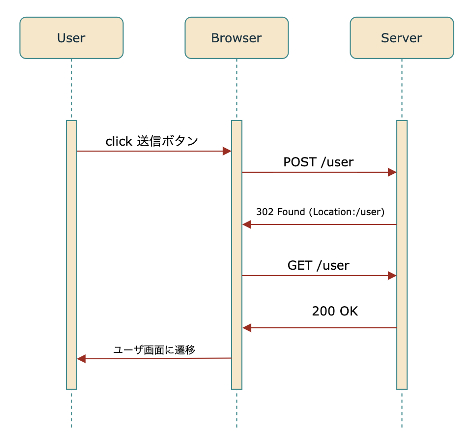

## PGRパターンとは?

PGRパターン(Post/Redirect/Get Pattern)とは、フォームの再送信を防ぐために使われるデザインパターン。

POSTメソッドでリクエストを受け取った場合、そのメソッドの処理の終わりに必ずRedirectし、処理後の結果はGetメソッドで呼び出せる画面に返しましょうというデザインパターンです。

## 参考文献

[POST メソッドの多重送信を防ぐ PRG パターンとは | poco-tech](https://poco-tech.com/posts/spring-boot-introduction/post-redirect-get-pattern/#:~:text=PRG%20%E3%83%91%E3%82%BF%E3%83%BC%E3%83%B3%E3%81%A8%E3%81%AF%E3%80%81%E3%83%96%E3%83%A9%E3%82%A6%E3%82%B6,%E3%83%AA%E3%83%80%E3%82%A4%E3%83%AC%E3%82%AF%E3%83%88%E3%82%92%E6%B4%BB%E7%94%A8%E3%81%97%E3%81%BE%E3%81%99%E3%80%82)
