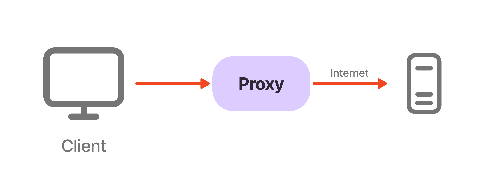
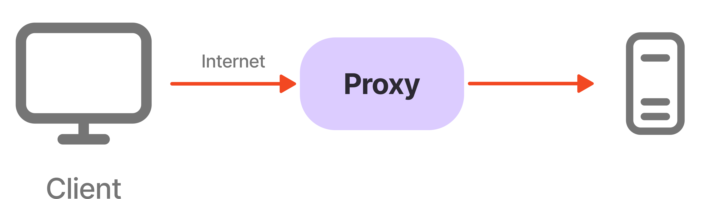

## はじめに

この記事ではまずProxyについて解説し、さらに理解を深めるために、実際にGoでプロクシサーバを構築してみます。

## Proxyとは？

プロキシ(Proxy)とは、一般的にプロキシサーバのことをいい、インターネットへのアクセスを代理で行うサーバのこと。一部の人からはプロクシと呼ばれる。というのも、プロキシを介することをネットスラングで「串を刺す」と呼ばれるため。

## Proxyの種類

Proxyは大きく分けて2種類存在する。

1. フォワードプロキシ (Forward Proxy)
1. リバースプロキシ (Reverse Proxy)

一般的にプロキシと呼べば、フォワードプロキシの方を指す。

## プロキシの設定方法

プロキシの設定方法の違いでより細かく分類される。

1. 明示型プロキシ(Explicit Proxy)
1. 透過型プロキシ(Transparent Proxy)
1. 匿名プロキシ (Anonymous Proxy)
1. ハイデンプロキシ (High Anonymity Proxy)
1. キャッシュプロキシ (Caching Proxy)
1. SSLプロキシ (SSL Proxy)
1. SOCKSプロキシ (SOCKS Proxy)

### フォワードプロキシ



### リバースプロキシ



https://eset-info.canon-its.jp/malware_info/special/detail/150804_1.html
https://knowledge.surfpoint.jp/knowledge/surf-anonymous-network-attribute-data/

### 明示型プロキシ(Explicit Proxy)

明示型プロキシとは、プロキシの設定方法の一つで、プロキシを利用したいクライアント端末でプロキシの設定を入れる（明示する）方法である。

### 透過型プロキシ

透過型プロキシも明示型プロキシと同様、プロキシの設定方法の一つ。
管理側のネットワーク制御により、強制的にプロキシサーバを経由させるプロキシです。
事前にプロキシサーバーの証明書をクライアント側にインストールしておくだけで、プロキシサーバーを経由することができます。ユーザー側でクライアントマシンの細かな設定をする必要がないため、プロキシ設定の手間を省きたいときなどに利用される。第三者に公開されていないので、非公開プロキシであることが多い。

### 匿名プロキシ

アノニマイザとも呼ばれる。インターネット上のアクティビティを追跡できないようにすることを目的としたプロキシサーバ。送信元の情報を秘匿する。一般的に公開されている誰でも使用できるものを公開プロキシと呼ぶ。

クライアント側がIPアドレスなどの痕跡を完全に消したいときは、Tor(The Onion Router)・Privoxy・Proxychainsのように複数のプロキシを中継するタイプのものが使用される。これらは **多段串** と呼ばれる。

https://eset-info.canon-its.jp/malware_info/special/detail/150804_1.html

### 匿名化のプロセスに用いられるプロトコル

以下の3種類のプロトコルが匿名化に用いられる。HTTPSは用いられない。

* HTTP
* SOCKS4
* SOCKS5

### エリートプロキシ

高匿名プロキシ(High Anonymity Proxy)とも呼ばれる。最高レベルの匿名性を提供する。接続先のサーバはユーザの実際のIPアドレスに関する情報を一切受け取らない。接続がプロキシ経由で行われたことすら検知できない。
ローテーションプロキシ(Rotating Proxies)とワールドプロキシなどが該当する。

### プロキシの匿名性レベル

Level1 : エリートプロキシ
Level2 : 匿名プロキシ
Level3 : 透過プロキシ

https://docs.proxymesh.com/article/78-proxy-anonymity-levels

https://ja.proxyscrape.com/%E3%83%96%E3%83%AD%E3%82%B0/%E4%BB%A3%E7%90%86%E5%8C%BF%E5%90%8D%E3%83%AC%E3%83%99%E3%83%AB#proxy-anonymity-level-1-elite-proxy

### SWG（セキュアWebゲートウェイ）

### キャッシュプロキシ

https://docs.opnsense.org/manual/proxy.html

## 実装

### server

まず、前提準備として簡易的なサーバを建てる。

```go
func main() {
    app := fiber.New()

    app.Get("/health", func(c *fiber.Ctx) error {
        return c.JSON(fiber.Map{
            "status": "OK!",
        })
    })

    app.Listen(":8080")
}
```

そして、以下のようにサーバを起動する。

```shellsession
$ go run .
 ┌───────────────────────────────────────────────────┐ 
 │                   Fiber v2.52.6                   │ 
 │               http://127.0.0.1:8080               │ 
 │       (bound on host 0.0.0.0 and port 8080)       │ 
 │                                                   │ 
 │ Handlers ............. 2  Processes ........... 1 │ 
 │ Prefork ....... Disabled  PID .............. 2066 │ 
 └───────────────────────────────────────────────────┘ 
$ curl http://localhost:8080/health
{"status":"OK!"}
```

### フォワードプロキシの実装

```go
func main() {
    // プロキシサーバを設定
    proxyURL := "http://localhost:8080"
    parsedURL, err := url.Parse(proxyURL)
    if err != nil {
        log.Fatalf("無効なURL: %v", err)
    }

    // HTTPクライアントをプロキシURLで設定
    proxyClient := &http.Client{
        Transport: &http.Transport{
            Proxy: http.ProxyURL(parsedURL),
        },
    }

    // サーバを起動してリクエストを受け取る
    http.HandleFunc("/", func(w http.ResponseWriter, r *http.Request) {
        // プロキシ先にリクエストを転送
        req, err := http.NewRequest(r.Method, proxyURL+r.RequestURI, r.Body)
        if err != nil {
            http.Error(w, fmt.Sprintf("リクエストの作成失敗: %v", err), http.StatusInternalServerError)
            return
        }

        // ヘッダーを転送
        req.Header = r.Header

        // プロキシ先にリクエストを送信
        resp, err := proxyClient.Do(req)
        if err != nil {
            http.Error(w, fmt.Sprintf("リクエストの転送失敗: %v", err), http.StatusInternalServerError)
            return
        }
        defer resp.Body.Close()

        // レスポンスをそのままクライアントに返す
        for key, value := range resp.Header {
            w.Header()[key] = value
        }
        w.WriteHeader(resp.StatusCode)
        io.Copy(w, resp.Body)
    })

    // プロキシサーバをポート8080で起動
    log.Println("プロキシサーバがポート8080で起動しました...")
    log.Fatal(http.ListenAndServe(":8000", nil))
}
```

プロキシサーバを起動して、以下のコマンドを叩くとプロキシを介してサーバにアクセスすることができる。

```shellsession
$ curl http://localhost:8000/health -x http://localhost:8080
{"status":"OK!"}
```

### リバースプロキシの実装

```go
func main() {
    // リバースプロキシ先のURL (Fiberサーバー)
    target := "http://localhost:8080"

    // リバースプロキシの設定
    parsedURL, err := url.Parse(target)
    if err != nil {
        log.Fatal("URL解析エラー: ", err)
    }

    // リバースプロキシを作成
    proxy := httputil.NewSingleHostReverseProxy(parsedURL)

    // リバースプロキシサーバーのハンドラー設定
    http.Handle("/", proxy)

    // ポート8080でリバースプロキシサーバーを開始
    log.Println("リバースプロキシサーバーを開始します: ポート 8081")
    if err := http.ListenAndServe(":8081", nil); err != nil {
        log.Fatal("サーバー起動エラー: ", err)
    }
}
```

起動してから以下のコマンドを叩くとアクセスできる。

```shellsession
$ curl http://localhost:8081/health
{"status":"OK!"}
```
