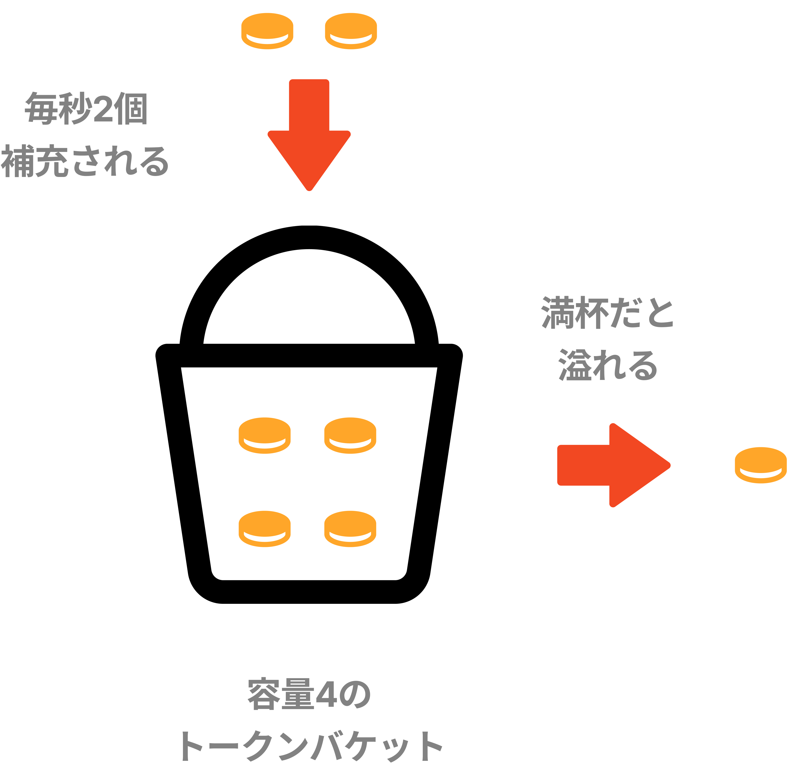
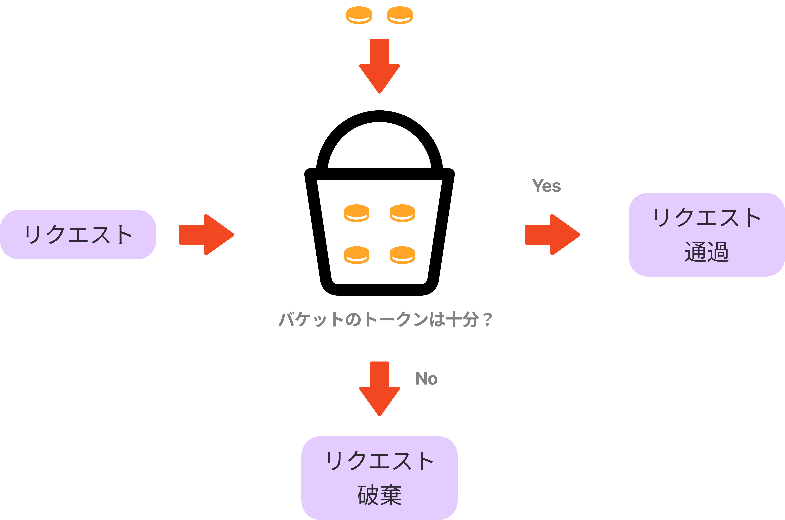

## 　レートリミッターとは

クライアントやサービスから送信されるトラフィックの速度を制御する仕組み。
例えば、APIレートリミッターを使用すると、APIリクエスト数が指定した閾値を超えると、すべてのコールがブロックされる。

## レートリミッターの目的

* DoS攻撃によるリソースの枯渇を防ぐ
* コストの削減
* サーバの過負荷を防ぐ

## レートリミッターのレイヤ

レートリミッタはクライアントサイドとサーバサイド両方に設置することができます。

### クライアントサイドでの実装

クライアントサイドに設置すると、リクエストを偽造される可能性がある。

以下は`lodash` を使用してAPIリクエストをスロットリングする例です。

```js
import _ from 'lodash';

const sendRequest = () => {
    console.log("APIリクエストを送信");
};

//  1秒ごとに1回のみ許可リクエストを許可
const throttledSendRequest = _.throttle(sendRequest, 1000);
```

### サーバサイドでの実装


サーバサイド側で実装した場合、アルゴリズムは完全に制御でき、技術スタックなども有効なものを使用することができるが、レートリミッターを独自に構築することはコストがかかります。

### ミドルウェアで実装


ミドルウェアでレートリミッターを実装すると、リクエストをスロットリングし、ステータスコード429のレスポンスを返します。
429のステータスコードはユーザが多すぎるリクエストを送信したことを表します。

クラウドマイクロサービスなどでは、APIゲートウェイというレート制限、SSL終了、認証、IPホワイトリスト、静的コンテンツのサービなどをサポートするフルマネージドサービスがあります。サーバサイドにレートリミッターを設置するのに対して、APIゲートウェイはマイクロサービスと相性がよく、導入も容易いです。

## レートリミッターのアルゴリズム

レートリミッターにはあらゆるアルゴリズムが存在する。

* [トークンバケット]((#トークンバケットアルゴリズム))(Token Bucket)
* [リーキーバケット](#リーキーバケットアルゴリズム)(Leaky Bucket)
* [固定ウィンドウカウンタ]((#固定ウィンドウカウンタアルゴリズム))(Fixed Window Counters)
* [スライディングウィンドウログ](#スライディングウィンドウログアルゴリズム)(Sliding Window Log)
* [スライディングウィンドウカウンタ](#スライディングウィンドウカウンタアルゴリズム)(Sliding Window Counter)

### トークンバケットアルゴリズム

シンプルでわかりやすく、幅広く使われている。AmazonやStripeはこのアルゴリズムでAPIリクエストを制限している。
トークンバケットというあらかじめ決められた容量のコンテナがあり、定期的にトークンが入れられる。

以下の例では、容量4のトークンバケットがあり、そこに1秒に2個のトークンが定期的に入れられる。バケットがいっぱいだと、余分なトークンは溢れる。



上記のようなトークンバケットの仕組みを用いて、リクエストを捌いていく。

1. 定期的にトークンがバケットに追加される
1. トークンがバケット内に残っていれば、トラフィックを通す(1リクエストにつき1トークン)
1. トークンがバケット内に残っていなければ、トラフィックを破棄する(キューに入れてもよい)



トークンバケットアルゴリズムでは以下2つのパラメータを取る。

* バケットサイズ : バケットに入れられるトークンの最大数
* 補充率 : 1秒間にバケットに入れられるトークン数

また、状況に応じてバケットの数が変動する。例えば以下のような例が挙げられる。

* APIエンドポイントごとに異なるバケットを用意する
* IPアドレスに基づいてリクエストを制限する場合は、IPアドレスごとに1つのバケットを容姿する
* 1秒間に最大10000のリクエストを許可する場合、すべてのリクエストで共有されるグローバルバケットを使用する

トークンバケットアルゴリズムのメリットは以下のようなものがある。

* アルゴリズムが簡単
* メモリ効率が良い
* 短時間のバーストトラフィックが可能(トークンがある限り、リクエストは通過できる)

それに対して、デメリットはパラメータを適切に設定するのが難しいことが挙げられる。

### リーキーバケットアルゴリズム

リーキーバケットアルゴリズムは、トークンバケットと似ているが、リクエストの処理速度が一手であり、FIFO(先入れ先出し)のキューで実装される。
Shopifyなどがレート制限に使用している。


リーキーバケットアルゴリズムでは、以下2つのパラメータを取る。

* バケットサイズ : キューサイズと同じ。キューは一定の割合で処理されるリクエストを保持する
* 流出率 : 一定の割合で処理できるリクエスト数を定義する(一般的には秒単位で指定する)

リーキーバケットアルゴリズムのメリットは

* キューサイズに制限があるのでメモリ効率が良い
* リクエストは固定レートで処理されるため、安定した流出レートが必要なユースケースに適している

それに対して、デメリットは、

* トラフィックのバーストは古いリクエストでキューを見たし、それらが時間内に処理でされない場合、新しいリクエストはレート制限される
* パラメータのチューニングを適切にするのが難しい可能性がある

### 固定ウィンドウカウンタアルゴリズム

### スライディングウィンドウログアルゴリズム

### スライディングウィンドウカウンタアルゴリズム
