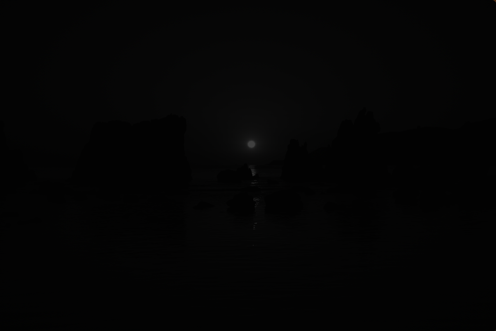
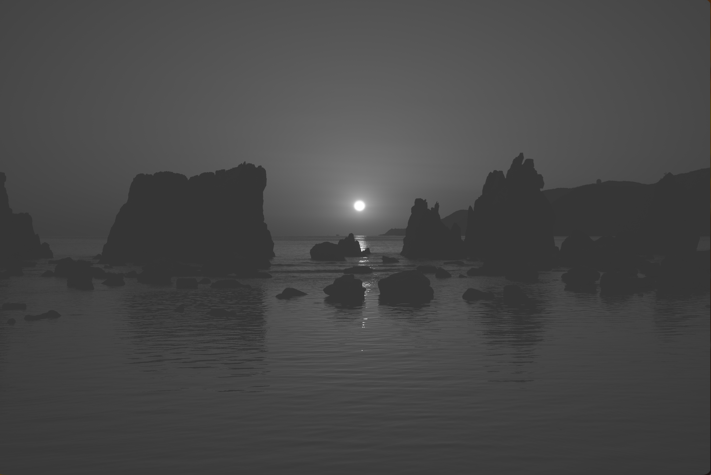
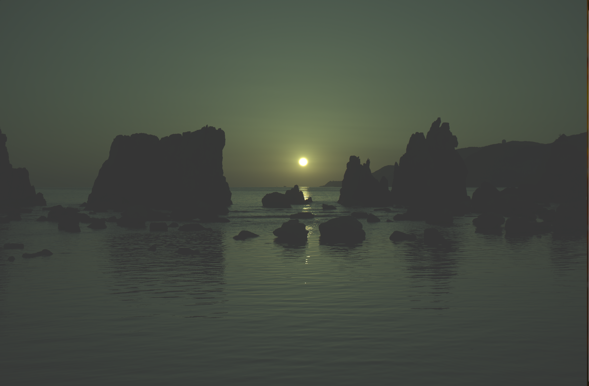

## はじめに

RAWファイルについては以下の記事で解説していますので、まずはそちらをご覧ください。

<BlogCard url="https://pathy.jp/posts/raw" />

この記事では、RAWファイルを画像として表示する方法について解説していきます。

サンプルコードや使用するRAWファイルは、[GitHubリポジトリ](https://github.com/tomo1227/raw-editor)に公開しています。

## PNM

PNMとは、以下3つのフォーマットの総称。

* PBM(Portable Bitmap File Format)：2値画像を表現する(.pbm)
* PGM(Portable Graymap File Format)：濃淡画像を表現する(.pgm)
* PPM(Portable Pixmap File Format)：カラー画像を表現する(.ppm)

上記はそれぞれ、ASCII形式とバイナリ形式の2種類が存在するため、合計6種類のフォーマットが存在します。

## PPM形式

PPM（Portable Pixmap）とは、8bit以上の階調が扱え、最も簡単でプログラミングしやすい非圧縮の画像フォーマットです。

## rawからグレースケールのppmに変換

ここではRustのrawloaderクレートを使用してRAWファイルを読み込み、PPM形式に変換して保存していきます。
ここでは、α7Ⅲで撮影した以下のようなRAWファイルを使用していきます。


まずは、[rawloader](https://docs.rs/rawloader/latest/rawloader/)のサンプルコードを動かしてみます。

```rust
use std::env;
use std::fs::File;
use std::io::BufWriter;
use std::io::prelude::*;

fn main() {
    let args: Vec<_> = env::args().collect();
    if args.len() != 2 {
        eprintln!("Usage: {} <file>", args[0]);
        std::process::exit(1);
    }
    let file = &args[1];
    let image = rawloader::decode_file(file).unwrap();

    let mut f = BufWriter::new(File::create(format!("{}.ppm", file)).unwrap());

    let preamble = format!("P6 {} {} 65535\n", image.width, image.height);
    f.write_all(preamble.as_bytes()).unwrap();

    if let rawloader::RawImageData::Integer(data) = image.data {
        for pix in data {
            let high = (pix >> 8) as u8;
            let low  = (pix & 0xff) as u8;
            f.write_all(&[high, low, high, low, high, low]).unwrap();
        }
    } else {
        eprintln!("Unsupported raw data type");
    }
}
```

これを実行すると、ほとんど真っ暗なPPMファイルが生成されます。



そこで以下のようにガンマ補正を加えてみます。

```rust
fn main() {
    let args: Vec<_> = env::args().collect();
    if args.len() != 2 {
        println!("Usage: {} <file>", args[0]);
        std::process::exit(2);
    }
    let file = &args[1];
    let image = rawloader::decode_file(file).unwrap();

    let mut f = BufWriter::new(File::create(format!("{}.ppm", file)).unwrap());
    let preamble = format!("P6 {} {} 255\n", image.width, image.height).into_bytes();
    f.write_all(&preamble).unwrap();

    if let rawloader::RawImageData::Integer(data) = image.data {
        let max_value = *data.iter().max().unwrap() as f32;
        for pix in data {
            let mut v = pix as f32 / max_value;
            v = v.powf(1.0 / 2.2);
            let pix8 = (v * 255.0).clamp(0.0, 255.0) as u8;
            f.write_all(&[pix8, pix8, pix8]).unwrap();
        }
    }
}
```

すると、以下のようなPPMファイルが生成されます。



上記のコードでは、以下の流れで処理しています。

1. RAWファイルを読み込んでデコード
1. PPMファイルのヘッダを書き込む
1. RAW データからピクセル値配列の抽出
1. 最大値で正規化
1. ガンマ補正
1. RGBに変換8ビットに変換
1. グレースケールとしてPPMファイルに書き込み

<Note title="PPMなのにグレースケール?">
ここで、グレースケールならPBMでは?と疑問に思った方もいると思います。
PPMはカラー画像ですが、ここではグレースケールの値をRGBの3チャンネルに同じ値で書き込んでいます。

```rust
let preamble = format!("P6 {} {} 255\n", image.width, image.height).into_bytes();
```

1画素ごとにRGBを3バイト書き込んでいます。

```rust
f.write_all(&[pix8, pix8, pix8])
```

このように、PPM形式でグレースケール画像を表現することも可能です。
</Note>

### 最大値で正規化

```rust
let max_value = *data.iter().max().unwrap() as f32;
```

`data`はRAW画像のピクセル値の配列で、`max_value`はその中の最大値を取得しています。
実際に出力してみると以下のようになります。

```rust
println!("data: {}", data.len()); // data: 24337152
println!("max_value: {}", max_value); // max_value: 16383
```

ここでSONY α7Ⅲの画素数は最大2400万画素と公開されていますが、ゆえにRAWデータのピクセル値の配列は24337152個となっています。

次に最大値は16383となっていますが、これは $2^{14} - 1$ であることから、RAWデータは14ビットで表現されていることがわかります。

得られた最大値を使用して、以下のようにピクセル値を0.0から1.0の範囲に正規化します。

```rust
let mut v = pix as f32 / max_value;
```

### ガンマ補正

カメラで撮ったRAWデータはセンサーからのリニアな光量情報です。つまり、センサーに当たった光の強さがそのまま数値化されています。リニアな値をそのままディスプレイに出すと、暗い部分は黒潰れして、明るい部分は白飛びしてしまうという問題が出てきます。人間の目もディスプレイと同じく、光の強さに線形に反応しません。簡単にいうと、光の強さが10倍になったとしても、人間の目は必ずしも10倍の明るさとして感じられるわけではありません。そこで 人間の目やディスプレイの特性に合わせて明るさを補正する処理が **ガンマ補正** です。

ガンマ補正は、一般的に以下の式で表されます。

```math
V_{in} \in [0,1]のとき
```

```math
V_{out} = cV_{in}^{\gamma}
```

ディスプレイの場合は、$V_{in}$が画面の明るさを表し、$V_{out}$が人間の目が感じる明るさを表します。$\gamma$は、一般的には2.2が使用されます。つまり、入力の明るさを約2.2乗することで、出力の明るさを人間の目に合わせて補正しています。

Rustのコードでは、$\gamma=2.2$でガンマ補正を行っています。

```rust
v = v.powf(1.0 / 2.2);
```

### グレースケール

$R = G = B$ のときは必ずグレーになります。
ゆえに以下のコードで全画素にグレースケールのPPMファイルを生成できます。

```rust
f.write_all(&[pix8, pix8, pix8]).unwrap();
```

ちなみに、当たり前ですが1画素の色の変化は以下のようになります。

| R   | G   | B   | 見える色 |
| :-: | :-: | :-: |   :-:    |
| 255 | 0   | 0   | 赤       |
| 0   | 255 | 0   | 緑       |
| 0   | 0   | 255 | 青       |
| 255 | 255 | 0   | 黄色     |
| 128 | 128 | 128 | 灰色     |

## CFA

CFA(Color Filter Array)とは、カメラのイメージセンサー（CCD／CMOS）の各画素上に配置される、RGBのカラーフィルター配列のことです。これにより、各画素が特定の色成分の情報を取得できるようになっています。
CFAの代表的な方式には、ベイヤー配列とX-Trans配列があります。一般的なデジタルカメラの多くはベイヤー配列を採用しています。一方、富士フイルムは独自に開発したX-Trans配列を採用しています。(参考:[X-Trans CMOS](https://www.fujifilm-x.com/ja-jp/products/x-trans-cmos/))

ベイヤー配列はR,G,Bのフィルタを2×2のマトリックスで配置されており、`RGGB`, `BGGR`, `GRBG`, `GBRG`の4種類のパターンがあります。基本は`RGGB`が使われています。

<Note title="なぜベイヤー配列は緑が多いのか？">
ベイヤー配列にRGGBのように緑だけ2つある理由は、人間の目が緑に対して最も敏感であるためです。緑のフィルタを多く配置することで、より高解像度に見えるようになります。
</Note>

α7Ⅲはベイヤー配列のカメラなので、RAWデータはベイヤー配列で記録されており、CFAは`RGGB`となっています。

```rust
println!("CFA: {:?}", image.cfa); // CFA: RGGB
```

## rawからカラーのppmに変換

先ほどのコードはグレースケールのPPMファイルを生成するものでしたが、CFAの情報を利用してカラーのPPMファイルを生成することもできます。
以下のコードが、RAWデータからカラーのPPMファイルを生成するコードになります。

```rust
use std::env;
use std::fs::File;
use std::io::prelude::*;
use std::io::BufWriter;
fn main() {
    let args: Vec<_> = env::args().collect();
    if args.len() != 2 {
        println!("Usage: {} <file>", args[0]);
        std::process::exit(2);
    }

    let file = &args[1];
    let image = rawloader::decode_file(file).unwrap();

    let width = image.width as usize;
    let height = image.height as usize;

    let mut f = BufWriter::new(File::create(format!("{}.ppm", file)).unwrap());

    if let rawloader::RawImageData::Integer(data) = image.data {
        let max_value = *data.iter().max().unwrap() as f32;

        // 2x2にまとめるので解像度半分
        let out_width = width / 2;
        let out_height = height / 2;

        write!(f, "P6 {} {} 255\n", out_width, out_height).unwrap();

        // RGGBの単純なデモザイク
        for y in (0..height - 1).step_by(2) {
            for x in (0..width - 1).step_by(2) {
                let i = y * width + x;

                let r = data[i] as f32;

                let g1 = data[i + 1] as f32;
                let g2 = data[i + width] as f32;
                let g = (g1 + g2) * 0.5;

                let b = data[i + width + 1] as f32;

                // 正規化
                let mut r = r / max_value;
                let mut g = g / max_value;
                let mut b = b / max_value;

                // ガンマ補正
                r = r.powf(1.0 / 2.2);
                g = g.powf(1.0 / 2.2);
                b = b.powf(1.0 / 2.2);

                // 8bit化
                let r8 = (r * 255.0).clamp(0.0, 255.0) as u8;
                let g8 = (g * 255.0).clamp(0.0, 255.0) as u8;
                let b8 = (b * 255.0).clamp(0.0, 255.0) as u8;

                f.write_all(&[r8, g8, b8]).unwrap();
            }
        }
    }
}
```

これを実行すると、以下のようなカラーのPPMファイルが生成されます。



### デモザイク

デモザイク（Demosaicing）は、カメラのイメージセンサーで受光した各画素1色のみのモザイク状のデータを、補間処理によってRGB各色を持つフルカラー画像に変換する技術・処理です。ベイヤー配列RGGBからRGBを取り出すことで、2×2のマトリックスを1ピクセルに縮小しています。

2x2ピクセルが1ピクセルになるので、出力する画像の解像度は入力の半分にする必要があります。

```rust
let out_width = width / 2;
let out_height = height / 2;
```

次に、RGGBの単純なデモザイク処理を行います。
RとBは1画素からそのまま値を取りますが、Gは2画素から平均を取っています。

```rust
let r = data[i] as f32;
let g1 = data[i + 1] as f32;
let g2 = data[i + width] as f32;
let g = (g1 + g2) * 0.5;
let b = data[i + width + 1] as f32;
```

ただし、これは非常に単純なデモザイク処理であり、実際のカメラではより高度なアルゴリズムが使用されています。(参考: [デモザイクアルゴリズムうんちく | Optical Learning Blog](http://optical-learning-blog.realop.co.jp/?eid=44))単純な平均を取る方法は、エッジの色のにじみやモアレが発生する可能性があります。

LibRawなどのライブラリを使用すると、より高度なデモザイク処理を行うことができます。

## 参考文献

1. [PPMフォーマット | Optical Learning Blog](http://optical-learning-blog.realop.co.jp/?eid=14)
1. [PNM形式概説](https://nittc.tokyo-ct.ac.jp/web/j/usr/nisimura/misc/format/pnm.html)
1. [ガンマ補正のうんちく #ガンマ補正 - Qiita](https://qiita.com/yoya/items/122b93970c190068c752)
1. [ガンマ補正](https://fujiwaratko.sakura.ne.jp/infosci/gamma.html)
1. [X-Trans CMOS | FUJIFILM X Series & GFX - Japan](https://www.fujifilm-x.com/ja-jp/products/x-trans-cmos/)
1. http://optical-learning-blog.realop.co.jp/?eid=44
