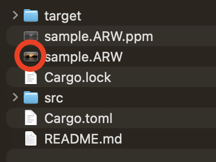

## RAWとは

RAWファイルは、いわゆる生のデータであり、カメラのイメージセンサーが捉えた未加工の画像データです。
ただし、単なる生の画像データだけでなく、以下のような複数の関連情報をまとめて格納するコンテナ形式となっています。

* センサー生データ(Bayer配列など)
* メタデータ（Exifなど）
* カメラ固有の補正情報
* プレビューJPEG
* サムネイル

RAWはTIFF（Tagged Image File Format）構造を拡張したコンテナであり、中身にRAWデータやJPEG、Exifなどが含まれています。ゆえにRAWファイルは、含めるデータがカメラメーカーごとに異なるので、あらゆる拡張子で形式で保存されます。SONYはARW、CanonはCR3、NikonはNEFなどがあります。また、同じメーカーでも機種によってRAWファイルの構造が異なることもあります。(例: SONY α7Ⅲとα7VのRAWファイルは構造が異なる)そのため、LightroomなどのRAW現像ソフトは、各カメラメーカーのRAWファイルの構造を解析して、RAWデータを正しく処理する必要があります。

例えば、SONY α7ⅢのRAWファイルは以下のようになっています。

```sh
ARW
├─ TIFFヘッダ
├─ IFD0
│   ├─ 基本タグ（ImageWidth, ImageHeightなど）
│   ├─ EXIF情報（F値、ISOなど）
│   ├─ Preview JPEG
│   └─ カメラ固有タグ（MakerNoteなど）
├─ IFD1（サムネイル用ディレクトリ）
├─ SubIFD（RAW固有データ領域）
│   ├─ センサー生データ（Bayerなど）
│   └─ カメラ固有のメタデータ
└─ その他のメタデータ領域
```

## RAWファイルの構造

[ExifTool](https://exiftool.org/)を使用して、`exiftool -v3 <RAWファイル>`コマンドを実行することで、RAWファイルの構造を詳細に確認することができます。以下は、Sony α7ⅢのRAWファイル（ARW形式）を例にした出力の一部です。

<Accordion title="RAWファイルの構造">

```sh
$ exiftool -v3 sample.ARW
  ExifToolVersion = 13.50
  FileName = sample.ARW
  Directory = .
  FileSize = 49161728
  FileModifyDate = 1772013573
  FileAccessDate = 1772069643
  FileInodeChangeDate = 1772013573
  FilePermissions = 33216
  FileType = ARW
  FileTypeExtension = ARW
  MIMEType = image/x-sony-arw
  ExifByteOrder = II

+ [IFD0 directory with 21 entries, Little-endian]
  | 0)  SubfileType = 1
  |     - Tag 0x00fe (4 bytes, int32u[1]):
  |         0012: 01 00 00 00                                     [....]
  | 1)  Compression = 6
  |     - Tag 0x0103 (2 bytes, int16u[1]):
  |         001e: 06 00                                           [..]
  | 2)  ImageDescription =
  |     - Tag 0x010e (32 bytes, string[32]):
  |         010a: 20 20 20 20 20 20 20 20 20 20 20 20 20 20 20 20 [                ]
  |         011a: 20 20 20 20 20 20 20 20 20 20 20 20 20 20 20 00 [               .]
  | 3)  Make = SONY
  |     - Tag 0x010f (5 bytes, string[5]):
  |         012a: 53 4f 4e 59 00                                  [SONY.]
  | 4)  Model = ILCE-7M3
  |     - Tag 0x0110 (9 bytes, string[9]):
  |         0130: 49 4c 43 45 2d 37 4d 33 00                      [ILCE-7M3.]
  | 5)  Orientation = 1
  |     - Tag 0x0112 (2 bytes, int16u[1]):
  |         004e: 01 00                                           [..]
  | 6)  XResolution = 350 (350/1)
  |     - Tag 0x011a (8 bytes, rational64u[1]):
  |         013a: 5e 01 00 00 01 00 00 00                         [^.......]
```

</Accordion>

### TIFFヘッダー

TIFFヘッダーは、RAWファイルの最初に位置する部分であり、ファイルの構造を定義するための情報が含まれています。TIFFヘッダーには、以下のような情報が含まれています。

* TIFF標準のヘッダ : ファイルの先頭8バイト
* ソニー固有のタグ

```shellsession
$ od -Ax -tx1 -tx2 -c -N 256 sample.arw
0000000    49  49  2a  00  08  00  00  00  15  00  fe  00  04  00  01  00
             4949    002a    0008    0000    0015    00fe    0004    0001
           I   I   *  \0  \b  \0  \0  \0 025  \0 376  \0 004  \0 001  \0
0000010    00  00  01  00  00  00  03  01  03  00  01  00  00  00  06  00
             0000    0001    0000    0103    0003    0001    0000    0006
          \0  \0 001  \0  \0  \0 003 001 003  \0 001  \0  \0  \0 006  \0
0000020    00  00  0e  01  02  00  20  00  00  00  0a  01  00  00  0f  01
             0000    010e    0002    0020    0000    010a    0000    010f
          \0  \0 016 001 002  \0      \0  \0  \0  \n 001  \0  \0 017 001
0000030    02  00  05  00  00  00  2a  01  00  00  10  01  02  00  09  00
             0002    0005    0000    012a    0000    0110    0002    0009
         002  \0 005  \0  \0  \0   * 001  \0  \0 020 001 002  \0  \t  \0
         ・・・・
```

TIFF標準のヘッダに注目します。

```shellsession
0000000    49  49  2a  00  08  00  00  00
          I   I   *  \0  \b  \0  \0  \0
```

`49 49`が`II`でIntelリトルエンディアンを示しています。(`MM` なら Motorolaビッグエンディアン)
`2a 00`がTIFFのマジックナンバーである42を示しています。この値で「TIFF形式である」と識別できます。
`08 00 00 00`が最初のIFD（Image File Directory）のオフセットを示しています。つまり、最初のIFDはファイルの8バイト目から始まります。

### Preview JPEG

RAWファイル自体はバイナリであるため、直接画面に表示することはできません。そこで、プレビュー時にはRAWファイル内に含まれているPreview JPEGを表示しています。
MacなどでRAWファイルを選択してスペースキーを押すと、このプレビューが表示されます。
カメラでRAW+JPEG撮影をしている場合、RAWファイルのプレビューとJPEGファイルのプレビューを比較すると、RAWファイルのプレビューの方が表示が速いことがあります。これは、RAWファイルのプレビューでは軽量なプレビュー用JPEGが表示されるためです。

[ExifTool](https://exiftool.org/)でPreview JPEGの情報を確認してみます。

```shellsession
$ exiftool -v3 sample.ARW | grep Preview
  | 13) PreviewImageStart = 131234
  | 14) PreviewImageLength = 353296
  | | | 25) PreviewImageSize = 1080 1616
```

つまり、Preview JPEGは353,296 バイト(約 345 KB)で、解像度は1616x1080ピクセルです。
一方α7ⅢのフルサイズJPEGは、6000x4000ピクセルなので、フルサイズのJPEGの方が圧倒的に重いです。

### サムネイルJPEG

Preview JPEGと同様に、サムネイルJPEGもRAWファイル内に含まれています。サムネイルは、画像の小さなバージョンであり、ファイルブラウザやカメラのプレビュー画面などで使用されます。もちろんRAWファイルだけでなく、JPEGファイルにも含まれています。



サムネイルJPEGの情報も[ExifTool](https://exiftool.org/)で確認できます。

## EXIF(メタ情報)

EXIFも[ExifTool](https://exiftool.org/)を使用して確認できます。EXIFは、画像に関する様々な情報を含むメタデータであり、撮影日時、カメラの設定、レンズの情報などが含まれています。

<Accordion title="EXIFの構造">

```shellsession
$ exiftool sample.ARW
ExifTool Version Number         : 13.50
File Name                       : sample.ARW
Directory                       : .
File Size                       : 49 MB
File Modification Date/Time     : 2026:02:25 18:59:33+09:00
File Access Date/Time           : 2026:02:26 10:21:23+09:00
File Inode Change Date/Time     : 2026:02:25 18:59:33+09:00
File Permissions                : -rwx------
File Type                       : ARW
File Type Extension             : arw
MIME Type                       : image/x-sony-arw
Exif Byte Order                 : Little-endian (Intel, II)
Image Description               :
Make                            : SONY
Camera Model Name               : ILCE-7M3
Orientation                     : Horizontal (normal)
Software                        : ILCE-7M3 v4.01
Modify Date                     : 2026:02:21 06:36:44
Artist                          : Tomoki Ota
Subfile Type                    : Full-resolution image
Image Width                     : 6048
Image Height                    : 4024
Bits Per Sample                 : 14
Compression                     : Uncompressed
Photometric Interpretation      : Color Filter Array
Samples Per Pixel               : 1
Planar Configuration            : Chunky
X Resolution                    : 350
Y Resolution                    : 350
Resolution Unit                 : inches
CFA Repeat Pattern Dim          : 2 2
CFA Pattern 2                   : 0 1 1 2
Sony Raw File Type              : Sony Uncompressed 14-bit RAW
Sony Tone Curve                 : 8000 10400 12900 14100
Strip Offsets                   : 487424
Rows Per Strip                  : 4024
Strip Byte Counts               : 48674304
Chromatic Aberration Correction : Off
Distortion Correction           : Off
Default Crop Origin             : 12 12
Default Crop Size               : 6000 4000
Sony Crop Top Left              : 12 12
Sony Crop Size                  : 6000 4000
Preview Image Start             : 131234
Preview Image Length            : 353296
Y Cb Cr Positioning             : Co-sited
Copyright                       : Tomoki Ota
Exposure Time                   : 1/1000
F Number                        : 5.0
ISO                             : 100
Sensitivity Type                : Recommended Exposure Index
Recommended Exposure Index      : 100
Exif Version                    : 0231
Date/Time Original              : 2026:02:21 06:36:44
Create Date                     : 2026:02:21 06:36:44
Offset Time                     : +09:00
Offset Time Original            : +09:00
Offset Time Digitized           : +09:00
Components Configuration        : Y, Cb, Cr, -
Compressed Bits Per Pixel       : 16
Brightness Value                : 9.16171875
Exposure Compensation           : 0
Max Aperture Value              : 1.2
Metering Mode                   : Multi-segment
Light Source                    : Unknown
Flash                           : Off, Did not fire
Focal Length                    : 50.0 mm
Rating                          : 0
Brightness                      : 0
Long Exposure Noise Reduction   : Off
High ISO Noise Reduction        : Off
HDR                             : Off; Uncorrected image
WB Shift AB GM                  : 0 0
WB Shift AB GM Precise          : 0.00 0.00
Face Info Offset                : 94
Sony Date Time                  : 2026:02:21 06:36:44
Sony Image Height               : 4000
Sony Image Width                : 6000
Faces Detected                  : 0
Face Info Length                : 37
Meta Version                    : DC7303320222000
Creative Style                  : Standard
Color Temperature               : Auto
Color Compensation Filter       : 0
Scene Mode                      : Standard
Zone Matching                   : ISO Setting Used
Dynamic Range Optimizer         : Off
Image Stabilization             : Off
Color Mode                      : Standard
Full Image Size                 : 6000x4000
Preview Image Size              : 1616x1080
File Format                     : ARW 2.3.5
Flash Exposure Compensation     : 0
White Balance Fine Tune         : 0
White Balance                   : Auto
Sony Model ID                   : ILCE-7M3
Multi Frame Noise Reduction     : Off
Picture Effect                  : Off
Soft Skin Effect                : Off
Vignetting Correction           : Off
Lateral Chromatic Aberration    : Off
Distortion Correction Setting   : Off
Lens Type                       : E-Mount, T-Mount, Other Lens or no lens
Lens Spec                       : FE 50mm F1.2
Auto Portrait Framed            : No
Flash Action                    : Did not fire
Electronic Front Curtain Shutter: On
Focus Mode                      : AF-S
AF Area Mode Setting            : Flexible Spot
Flexible Spot Position          : 290 240
AF Point Selected               : n/a
AF Points Used                  : (none)
AF Tracking                     : Off
Focal Plane AF Points Used      : 0
Multi Frame NR Effect           : Normal
Focus Location                  : 6000 4000 2718 2000
Variable Low Pass Filter        : n/a
Priority Set In AWB             : White
Metering Mode 2                 : Multi-segment
Exposure Standard Adjustment    : 0
RAW File Type                   : Uncompressed RAW
Quality                         : RAW + Extra Fine
Pixel Shift Info                : n/a
Flash Level                     : Normal
Release Mode                    : Normal
Sequence Number                 : Single
Anti-Blur                       : Off
Sequence Image Number           : 1
Sequence File Number            : 1
Sequence Length                 : 1 file
Camera Orientation              : Horizontal (normal)
Quality 2                       : RAW + JPEG
Model Release Year              : 2017
ISO Setting                     : 100
ISO Auto Min                    : 100
ISO Auto Max                    : 12800
Ambient Temperature             : 8 C
AF Area Mode                    : Flexible Spot
Focus Position 2                : 255
Camera Temperature              : 9 C
Exposure Program                : Manual
Intelligent Auto                : Off
Sony ISO                        : 100
Base ISO                        : 100
Stops Above Base ISO            : 0
Sony Exposure Time 2            : 1/1024
Sony Max Aperture Value         : 1.2
Sony Image Width Max            : 6024
Sony Image Height Max           : 4024
Picture Effect 2                : Off
Lens Zoom Position              : 0%
Battery Temperature             : 14.4 C
Battery Level                   : 69%
Lens Mount 2                    : E-mount
Lens Type 3                     : Sony FE 50mm F1.2 GM
Camera E-mount Version          : 1.70
Lens E-mount Version            : 1.60
Lens Firmware Version           : Ver.02.000
Tiff Metering Image Width       : 44
Tiff Metering Image Height      : 30
Tiff Metering Image             : (Binary data 2640 bytes, use -b option to extract)
Release Mode 3                  : Normal
Self Timer                      : Off
Flash Mode                      : Fill-flash
HDR Setting                     : Off
Picture Profile                 : Gamma Still - Standard/Neutral (PP2)
WB RGB Levels                   : 581 256 444
Min Focal Length                : 50.0 mm
Distortion Corr Params Number   : 16 (Full-frame)
Aspect Ratio                    : 3:2
Shutter                         : Mechanical (2710 5175 6551)
Flash Status                    : No Flash present
Shutter Count                   : 53994
Sony Exposure Time              : 1/1024
Sony F Number                   : 4.9
Shutter Count 2                 : 53994
Release Mode 2                  : Normal
Internal Serial Number          : 6cff00003209
Lens Mount                      : E-mount
Lens Format                     : Full-frame
Lens Type 2                     : Unknown E-mount lens or other lens
Distortion Corr Params Present  : Yes
Lens Spec Features              : FE
Shutter Count 3                 : 53994
APS-C Size Capture              : Off
User Comment                    :
Flashpix Version                : 0100
Color Space                     : sRGB
Exif Image Width                : 6000
Exif Image Height               : 4000
Interoperability Index          : R98 - DCF basic file (sRGB)
Interoperability Version        : 0100
File Source                     : Digital Camera
Scene Type                      : Directly photographed
Custom Rendered                 : Normal
Exposure Mode                   : Manual
Digital Zoom Ratio              : 1
Focal Length In 35mm Format     : 50 mm
Scene Capture Type              : Standard
Contrast                        : Normal
Saturation                      : Normal
Sharpness                       : Normal
Lens Info                       : 50mm f/1.2
Lens Model                      : FE 50mm F1.2 GM
PrintIM Version                 : 0300
SR2 Sub IFD Offset              : 50670
SR2 Sub IFD Length              : 42826
SR2 Sub IFD Key                 : 0x44332211
Black Level                     : 512 512 512 512
WB RGGB Levels Auto             : 2336 1024 1024 1768
WB RGGB Levels                  : 2336 1024 1024 1768
Color Matrix                    : 1177 -211 91 -54 1267 -159 72 -232 1216
WB RGB Levels Daylight          : 2388 1024 1736
WB RGB Levels Cloudy            : 2580 1024 1596
WB RGB Levels Tungsten          : 1468 1024 3068
WB RGB Levels Flash             : 2620 1024 1540
WB RGB Levels 4500K             : 2152 1024 1948
WB RGB Levels Shade             : 2848 1024 1436
WB RGB Levels Fluorescent       : 2208 1024 2544
WB RGB Levels Fluorescent P1    : 2288 1024 1860
WB RGB Levels Fluorescent P2    : 2540 1024 1712
WB RGB Levels Fluorescent M1    : 1712 1024 3052
WB RGB Levels 8500K             : 2996 1024 1364
WB RGB Levels 6000K             : 2556 1024 1612
WB RGB Levels 3200K             : 1640 1024 2676
WB RGB Levels 2500K             : 1276 1024 3672
White Level                     : 15360 15360 15360
Vignetting Corr Params          : 16 0 0 112 384 800 1360 2000 2656 3376 4144 4976 5840 6752 7696 8672 9600
Chromatic Aberration Corr Params: 32 1024 1024 896 896 896 896 768 768 640 640 512 512 384 384 256 256 0 0 -128 -128 -128 -128 0 0 0 0 0 0 -128 -128 -128 -128
Distortion Corr Params          : 16 2 0 -6 -13 -22 -33 -47 -59 -71 -78 -81 -73 -51 -8 59 164
Thumbnail Offset                : 43342
Thumbnail Length                : 5795
Aperture                        : 5.0
Blue Balance                    : 1.726563
CFA Pattern                     : [Red,Green][Green,Blue]
Image Size                      : 6048x4024
Lens ID                         : Sony FE 50mm F1.2 GM
Megapixels                      : 24.3
Preview Image                   : (Binary data 353296 bytes, use -b option to extract)
Red Balance                     : 2.28125
Scale Factor To 35 mm Equivalent: 1.0
Shutter Speed                   : 1/1000
Create Date                     : 2026:02:21 06:36:44+09:00
Date/Time Original              : 2026:02:21 06:36:44+09:00
Modify Date                     : 2026:02:21 06:36:44+09:00
Thumbnail Image                 : (Binary data 5795 bytes, use -b option to extract)
Focus Distance 2                : inf
Circle Of Confusion             : 0.030 mm
Field Of View                   : 39.6 deg
Focal Length 35mm Equiv         : 50.0 mm (35 mm equivalent: 50.0 mm)
Hyperfocal Distance             : 16.64 m
Light Value                     : 14.6
```

</Accordion>

JPEGファイルにはEXIF情報が含まれていますが、RAWファイルのEXIFはExifToolで編集できない場合があります。
どうしてもRAWのEXIFを編集したい場合は、バイナリエディタを使用する必要があります。

## 参考文献

1. [lclevy/sony_raw: Description of Sony RAW file formats (SRF, SR2 and ARW)](https://github.com/lclevy/sony_raw)
1. [【カメラ】RAW画像とは？](https://faq.canon.jp/app/answers/detail/a_id/8879/~/%E3%80%90%E3%82%AB%E3%83%A1%E3%83%A9%E3%80%91raw%E7%94%BB%E5%83%8F%E3%81%A8%E3%81%AF%EF%BC%9F)
1. [Raw image format - Wikipedia](https://en.wikipedia.org/wiki/Raw_image_format?utm_source=chatgpt.com)
1. [Exif SubIFDで使われるTag - otouNow 日々雑々](https://otounow.jimdofree.com/exif%E3%83%95%E3%82%A9%E3%83%BC%E3%83%9E%E3%83%83%E3%83%88/exif-subifd%E3%81%A7%E4%BD%BF%E3%82%8F%E3%82%8C%E3%82%8Btag/)
