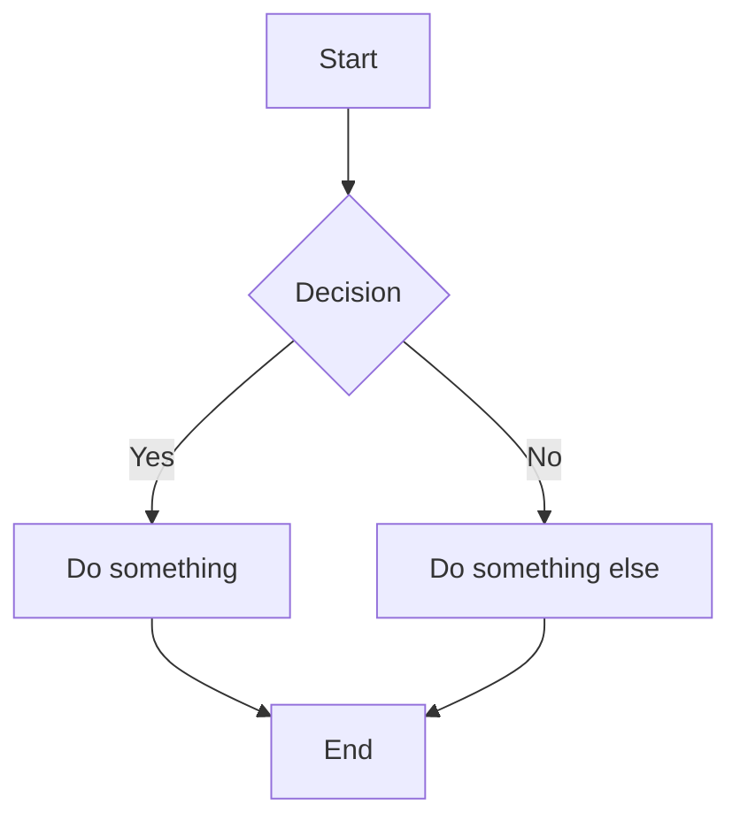
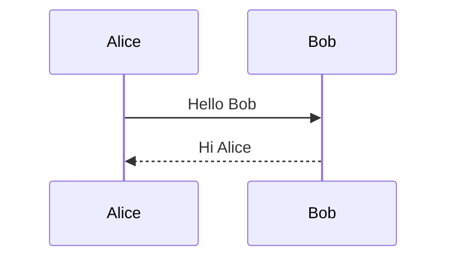
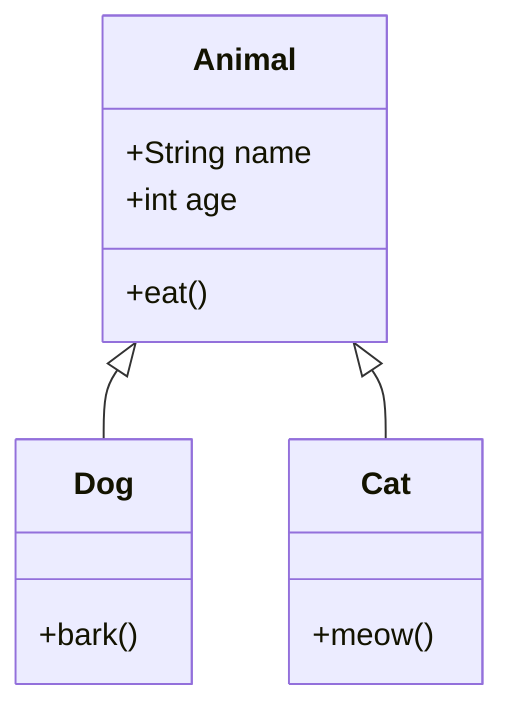
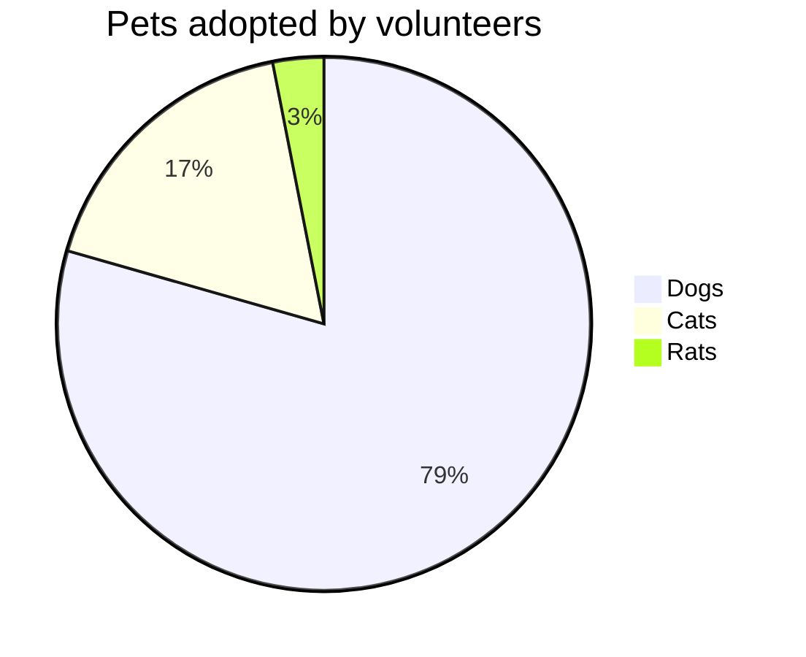

## はじめに

[Rehype Pretty Code](https://rehype-pretty.pages.dev)はShikiベースのシンタックスハイライト機能を提供するrehypeプラグイン。

<BlogCard url="https://github.com/rehype-pretty/rehype-pretty-code" />

<BlogCard url="https://shiki.style/" />

この記事では、実際にRehype Pretty Codを使用した例を挙げていきます。

## シンタックスハイライト

### タイトル

`title=""`でタイトルがつけられる。

````md
```go title="hello"
func main() {
  fmt.Println("hello")
}
```
````

```go title="hello"
func main() {
  fmt.Println("hello")
}
```

### キャプション

`caption=""`でタイトルがつけられる。

````md
```go caption="hello"
func main() {
  fmt.Println("hello")
}
```
````

```go caption="hello"
func main() {
  fmt.Println("hello")
}
```

### 行番号の追加

`showLineNumbers`をつけると行番号をつけられる。

````md
```go showLineNumbers
func main() {
  fmt.Println("hello")
}
```
````

```go showLineNumbers
func main() {
  fmt.Println("hello")
}
```

`showLineNumber{4}`のようにしたら最初の数字を変更できる。

````md
```go showLineNumbers{5}
func main() {
  fmt.Println("hello")
}
```
````

```go showLineNumbers{5}
func main() {
  fmt.Println("hello")
}
```

### 行ハイライト

`go {2}`のように行番号で指定する。

````md
```go {2}
func main() {
  fmt.Println("hello")
}
```
````

```go {2}
func main() {
  fmt.Println("hello")
}
```

### 文字のハイライト

`go /Println/｀のように単語を指定すると、特定の単語にハイライトをつけられる。
`"Println"`のように`"`でも可能。複数追加する場合は、`js /carrot/ /apple/`のようにする。

````md
```go /Println/
func main() {
  fmt.Println("hello")
}
```
````

```go /Println/
func main() {
  fmt.Println("hello")
}
```

### マーカー

グループを設定して、マーカをつけることができる。

````md
```js /age/#r /name/#r /setAge/#y /setName/#y /50/#p /"Taylor"/#p
const [age, setAge] = useState(50);
const [name, setName] = useState("Taylor");
```
````

```js /age/#r /name/#r /setAge/#y /setName/#y /50/#p /"Taylor"/#p
const [age, setAge] = useState(50);
const [name, setName] = useState("Taylor");
```

以下のcssを修正すると、マーカーの色やグループIDを変えたり追加したりすることができる。

```css
[data-chars-id="r"] {
  @apply !text-pink-300 bg-rose-800/50 border-b-pink-600 font-bold;
}

[data-chars-id="y"] {
  @apply !text-yellow-300 bg-yellow-800/50 border-b-yellow-600 font-bold;
}

[data-chars-id="p"] {
  @apply !text-purple-200 bg-purple-800/50 border-b-purple-600 font-bold;
}
```

### diff

`diff` + 言語のシンタックスハイライトを付与する。
Shikiのtransformerで実現している。

**\/\/ [!code --]**をつけると、`-`、**\/\/ [!code ++]** をつけると`+`になる。

表示されないのでmarkdownの方では`/`の後のスペースを抜いている。

````md
```go
func main() {
  fmt.Println("hello")  //[!code --]
  fmt.Println("see you") //[!code ++]
}
```
````

```go
func main() {
  fmt.Println("hello") // [!code --]
  fmt.Println("see you") // [!code ++]
}
```

### ANSIコード

ANSIコードのハイライトもできる。おそらく使用することはなさそう。

````md
```ansi
  vite v5.0.0 dev server running at:

  > Local: http://localhost:3000/
  > Network: use `--host` to expose

  ready in 125ms.

8:38:02 PM [vite] hmr update /src/App.jsx
```

Inline ANSI: `> Local: http://localhost:3000/{:ansi}`
````

```ansi
  vite v5.0.0 dev server running at:

  > Local: http://localhost:3000/
  > Network: use `--host` to expose

  ready in 125ms.

8:38:02 PM [vite] hmr update /src/App.jsx
```

Inline ANSI: `> Local: http://localhost:3000/{:ansi}`

## インラインコードのハイライト

### インラインコード内のプログラミング言語のシンタックスハイライト

```md
`[1, 2, 3].join('-'){:js}`
```

`[1, 2, 3].join('-'){:js}`

### Context Aware Inline Code

これは使えるが、自分の環境ではshikiのCSS変数と衝突して、文字の色が変化しない。

```js
function getStringLength(str) {
  return str.length;
}
```

```md
`getStringLength{:.entity.name.function}`
`function{:.keyword}`
`str{:.variable.parameter}`
`str{:.variable.other.object}`
```

`getStringLength{:.entity.name.function}`
`function{:.keyword}`
`str{:.variable.parameter}`
`str{:.variable.other.object}`

## カスタムコンポーネント

以下の例は既存のアイテムではなく、独自に作成したコンポーネント、CSSを適応して実装しています。

### BlogCard

ブログカードを表示します。

```tsx
<BlogCard url="https://tomokiota.com/" />
```

<BlogCard url="https://tomokiota.com/" />

### Accordion

アコーディオンです。折りたたみ表示を実現します。中身は`details`タグと`summary`タグで実装してます。

```tsx
<Accordion title="アコーディオンの例だよ！">
  こんにちは！
</Accordion>
```

<Accordion title="アコーディオンの例だよ！">
  こんにちは！
</Accordion>

## Mermaidの導入

この記事では、MDX内でMermaidのコードブロックを描画できるようにするまでの流れをまとめます。

[mermaid](https://www.npmjs.com/package/mermaid)と[remcohaszing/rehype-mermaid](https://github.com/remcohaszing/rehype-mermaid) をインストールします。

```shell
bun i mermaid rehype-mermaid
```

次に`rehype-mermaid` を `vite.config.ts` の `rehypePlugins` に追加します。

```ts title="vite.config.ts"
rehypePlugins: [
  rehypeSlug,
  rehypeKatex,
  rehypeMermaid, //[!code ++]
  rehypeStringify,
  [rehypePrettyCode, highlightOptions],
],
```

また、SSRのexternalにも `mermaid` を追加します。

```ts title="vite.config.ts"
ssr: {
  target: "node" as SSRTarget,
  external: [
    "unified",
    "@mdx-js/mdx",
    "satori",
    "@resvg/resvg-js",
    "feed",
    "budoux",
    "jsdom",
    "mermaid", //[!code ++]
    "tocbot",
  ],
},
```

### フローチャート



### シーケンス図



### クラス図



### 円グラフ


